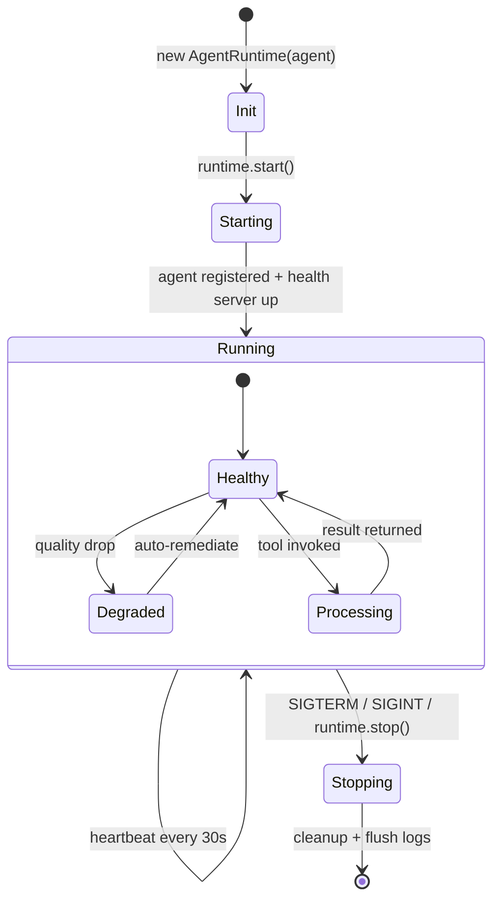

# @wave-av/adk — Agent Developer Kit

[](https://www.npmjs.com/package/@wave-av/adk)
[](https://www.npmjs.com/package/@wave-av/adk)
[](https://github.com/wave-av/adk/blob/main/LICENSE)

> **The video layer for AI agents.** Build agents that see, produce, and deliver video.

WAVE ADK is the complete toolkit for AI agents to interact with live video infrastructure. Like Stripe is for payments and Resend is for email — **WAVE is for live streaming and video**.

## Quick start

```bash
npm install @wave-av/adk
```

```typescript
import { StreamMonitorAgent } from '@wave-av/adk';

const monitor = new StreamMonitorAgent({
  apiKey: process.env.WAVE_AGENT_KEY,
  agentName: 'my-quality-monitor',
  streamIds: ['stream_abc123'],
  autoRemediate: true,
  onQualityDrop: async (alert) => {
    console.log(`Quality drop on ${alert.streamId}: ${alert.metric}`);
  },
});

await monitor.start();
```

## Agent lifecycle



**Endpoints while running:**
- `GET /health` — liveness probe (`{ status: "healthy", uptime: 12345 }`)
- `GET /ready` — readiness probe (`{ ready: true }`)
- `GET /metrics` — usage stats (`{ totalCalls: 42, totalDurationMs: 1200 }`)

## Agent templates

| Template | What It Does |
|----------|-------------|
| `StreamMonitorAgent` | Watches quality, auto-remediates degradation |
| `AutoProducerAgent` | AI-powered live show direction (camera switching, graphics) |
| `ClipFactoryAgent` | Detects highlights, auto-creates social clips |
| `ModerationAgent` | AI content moderation for chat and video |
| `CaptionAgent` | Real-time transcription and multi-language captions |

## MCP tools (10 tools)

```typescript
import { AgentToolkit } from '@wave-av/adk/tools';

const toolkit = new AgentToolkit({ apiKey: process.env.WAVE_AGENT_KEY });

// Get MCP-compatible tool definitions
const tools = toolkit.toMCPTools();
// → wave_create_stream, wave_monitor_stream, wave_create_clip,
//   wave_switch_camera, wave_show_graphic, wave_moderate_chat,
//   wave_start_captions, wave_analyze_quality, wave_mark_highlight,
//   wave_control_camera
```

## Agent runtime v2

Production-ready lifecycle with health endpoint, heartbeat, and structured logging:

```typescript
import { StreamMonitorAgent, AgentRuntime } from '@wave-av/adk';

const agent = new StreamMonitorAgent({ /* config */ });
const runtime = new AgentRuntime(agent, {
  healthPort: 8080,           // GET /health, /ready, /metrics
  heartbeatIntervalMs: 30000, // Platform heartbeat
  logLevel: 'info',           // Structured JSON logs
});

await runtime.start(); // Handles SIGTERM/SIGINT gracefully
```

## Subpath imports

Import only what you need for smaller bundles:

```typescript
// Tools only
import { AgentToolkit, WaveToolError } from '@wave-av/adk/tools';

// Agents only
import { WaveAgent, AgentRuntime } from '@wave-av/adk/agents';

// Framework adapters only
import { createMastraTools } from '@wave-av/adk/adapters';

// Agent templates
import { StreamMonitorAgent, ClipFactoryAgent } from '@wave-av/adk/templates';

// Type definitions
import type { StreamQualityAlert, ClipHighlight } from '@wave-av/adk/types';
```

## Framework adapters

```typescript
// Mastra — native TypeScript, MCP-first
import { createMastraTools } from '@wave-av/adk/adapters';

// LangGraph — LangChain state machines
import { createLangGraphTools } from '@wave-av/adk/adapters';

// LiveKit Agents — real-time voice/video
import { createLiveKitWaveTools } from '@wave-av/adk/adapters';

// Kernel.sh — cloud browser automation
import { createKernelTools } from '@wave-av/adk/adapters';
```

Or use the MCP server with ANY framework:
```json
{ "wave": { "command": "npx", "args": ["@wave-av/mcp-server"] } }
```

## Why WAVE ADK?

- **10 MCP tools** — plug into Claude, Cursor, or any MCP client
- **5 agent templates** — start producing in minutes, not weeks
- **6 subpath exports** — tree-shake to only what you need
- **Real infrastructure** — not a wrapper, actual video processing
- **Usage-based pricing** — pay per API call, plans from $19/month
- **Enterprise-ready** — multi-region architecture, designed for scale

## Troubleshooting

### Module not found with subpath imports

Ensure `"moduleResolution": "node16"` or `"nodenext"` in your `tsconfig.json`.

### ESM required error

ADK is ESM-first. Add `"type": "module"` to your `package.json`, or use dynamic imports:

```typescript
const { AgentToolkit } = await import("@wave-av/adk/tools");
```

CJS consumers can use `require()` — the package exports `.cjs` files via the `require` condition.

## Related packages

- [@wave-av/sdk](https://www.npmjs.com/package/@wave-av/sdk) — TypeScript SDK (34 API modules)
- [@wave-av/mcp-server](https://www.npmjs.com/package/@wave-av/mcp-server) — MCP server for AI tools
- [@wave-av/create-app](https://www.npmjs.com/package/@wave-av/create-app) — Scaffold a new agent project
- [@wave-av/cli](https://www.npmjs.com/package/@wave-av/cli) — Command-line interface

## Links

- [npm package](https://www.npmjs.com/package/@wave-av/adk)
- [GitHub](https://github.com/wave-av/adk)
- [Community](https://github.com/wave-av/adk/discussions)

## API Reference

See [docs.wave.online/sdk/adk](https://docs.wave.online/sdk/adk) for the complete API reference.

## Maturity

`@wave-av/adk` is in **prototype**. Per [maturity-language-policy.md](../../.claude/rules/80-copywriting/maturity-language-policy.md). Track changes in [CHANGELOG.md](./CHANGELOG.md).

## Support

Report issues at [github.com/wave-av/wave-surfer-connect/issues](https://github.com/wave-av/wave-surfer-connect/issues).

## Verify Install

Once OIDC trusted-publisher binding lands, every CI publish emits Sigstore provenance attestations.

```bash
npm audit signatures @wave-av/adk
```

See [docs/security/verify-npm-package.md](../../docs/security/verify-npm-package.md).

## License

MIT — see [LICENSE](./LICENSE).
